# Cloud Computing Learning Path: GCP to AWS

This learning guide covers cloud computing fundamentals, focusing on Google Cloud Platform (GCP) and Amazon Web Services (AWS). The curriculum emphasizes practical skills in managing, administering, securing, and observing cloud infrastructure, with a strong foundation in containerization (Docker) and orchestration (Kubernetes).

## Table of Contents

### GCP Section
1. [GCP Fundamentals](#gcp-fundamentals)
2. [Docker and Kubernetes Basics](#docker-and-kubernetes-basics)
3. [Google Kubernetes Engine (GKE)](#google-kubernetes-engine-gke)
4. [Infrastructure as Code with Terraform](#infrastructure-as-code-with-terraform)
5. [GitOps with Argo CD](#gitops-with-argo-cd)
6. [CI/CD with GitLab](#cicd-with-gitlab)
7. [Security in GCP](#security-in-gcp)
8. [Networking in GCP](#networking-in-gcp)
9. [Observability on GCP](#observability-on-gcp)
10. [Debugging and Troubleshooting](#debugging-and-troubleshooting)

### AWS Section
11. [AWS Fundamentals](#aws-fundamentals)
12. [Amazon EKS (Elastic Kubernetes Service)](#amazon-eks-elastic-kubernetes-service)
13. [Infrastructure as Code with Terraform on AWS](#infrastructure-as-code-with-terraform-on-aws)
14. [CI/CD with GitLab on AWS](#cicd-with-gitlab-on-aws)
15. [Security in AWS](#security-in-aws)
16. [Networking in AWS](#networking-in-aws)
17. [Observability on AWS](#observability-on-aws)
18. [Debugging and Troubleshooting on AWS](#debugging-and-troubleshooting-on-aws)

---

## GCP Fundamentals

### Prerequisites
- None

### Learning Objectives
- Understand GCP core services
- Navigate GCP Console
- Basic resource management

### Key Concepts
- Projects and Organizations
- IAM (Identity and Access Management)
- Billing and Cost Management
- Budgets, quotas, and alerts
- Regions and Zones

### Hands-on Exercises
1. Create a GCP project
2. Set up billing alerts and a budget
3. Explore GCP Console

### Visual: GCP Architecture Overview
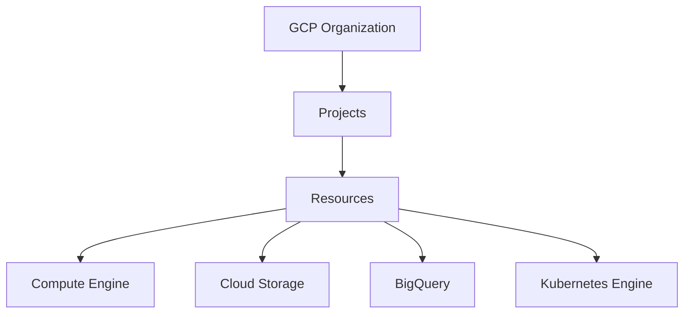

---

## Docker and Kubernetes Basics

### Prerequisites
- [GCP Fundamentals](#gcp-fundamentals)

### Learning Objectives
- Master containerization with Docker
- Understand Kubernetes orchestration
- Deploy applications in containers

### Key Concepts
- Docker Images and Containers
- Kubernetes Pods, Services, Deployments
- kubectl commands
- YAML manifests
- ConfigMaps, Secrets, and namespaces

### Hands-on Exercises
1. Build and run Docker containers
2. Create Kubernetes deployments
3. Expose services and inspect logs

### Visual: Container vs VM
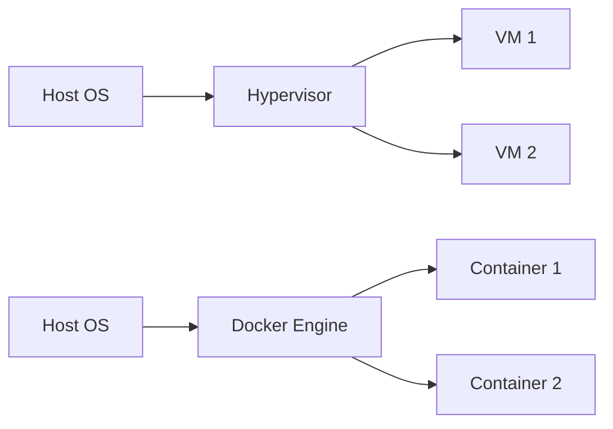

---

## Google Kubernetes Engine (GKE)

### Prerequisites
- [Docker and Kubernetes Basics](#docker-and-kubernetes-basics)

### Learning Objectives
- Deploy and manage GKE clusters
- Configure node pools
- Implement autoscaling

### Key Concepts
- GKE cluster architecture
- Node pools and machine types
- Autopilot vs Standard mode
- Cluster upgrades
- Workload Identity
- Horizontal and cluster autoscaling

### Hands-on Exercises
1. Create a GKE cluster
2. Deploy applications
3. Configure autoscaling and Workload Identity

### Visual: GKE Cluster Architecture
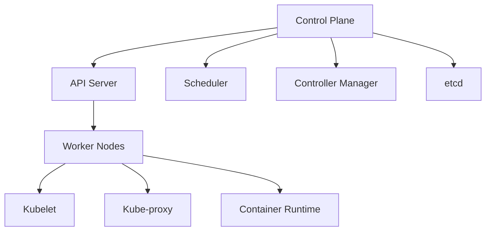

---

## Infrastructure as Code with Terraform

### Prerequisites
- [GCP Fundamentals](#gcp-fundamentals)

### Learning Objectives
- Write Terraform configurations
- Manage GCP resources with Terraform
- Implement state management

### Key Concepts
- Terraform providers
- Resources and data sources
- Variables and outputs
- Remote state and state locking
- Modules and workspaces

### Hands-on Exercises
1. Install Terraform
2. Create GCP resources
3. Configure remote state
4. Manage infrastructure lifecycle

### Visual: Terraform Workflow
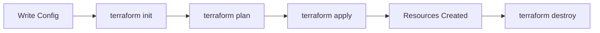

---

## GitOps with Argo CD

### Prerequisites
- [Docker and Kubernetes Basics](#docker-and-kubernetes-basics)
- [GKE](#google-kubernetes-engine-gke)

### Learning Objectives
- Implement GitOps workflows
- Deploy applications with Argo CD
- Manage application lifecycle

### Key Concepts
- GitOps principles
- Argo CD applications
- Sync strategies
- Rollbacks
- Drift detection
- Environment promotion

### Hands-on Exercises
1. Install Argo CD on GKE
2. Create Argo CD applications
3. Implement automated deployments and rollback workflows

### Visual: Argo CD Architecture
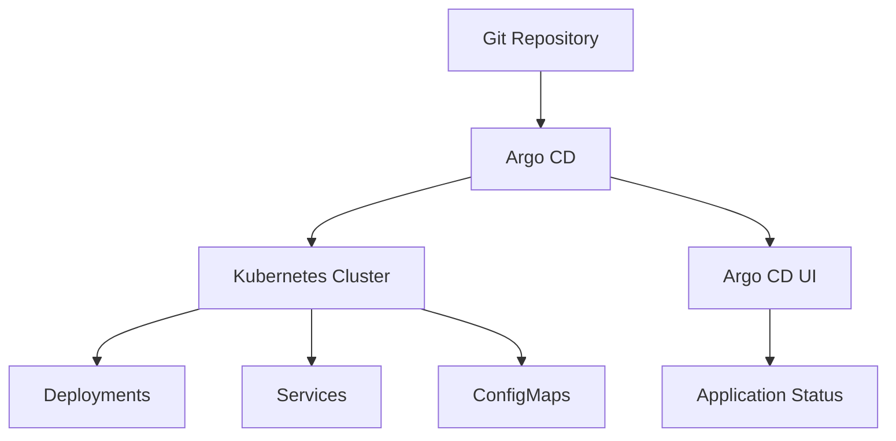

---

## CI/CD with GitLab

### Prerequisites
- [Docker and Kubernetes Basics](#docker-and-kubernetes-basics)
- [GKE](#google-kubernetes-engine-gke)

### Learning Objectives
- Set up GitLab CI pipelines
- Build and deploy containerized apps
- Implement testing and security scans

### Key Concepts
- GitLab CI/CD pipelines
- .gitlab-ci.yml
- Runners and executors
- Artifacts and caching
- Container registry integration
- Pipeline secrets and protected environments

### Hands-on Exercises
1. Configure GitLab project
2. Create CI/CD pipeline
3. Build and push an image to Artifact Registry
4. Deploy to GKE

### Visual: GitLab CI Pipeline
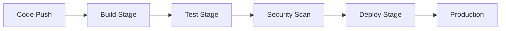

---

## Security in GCP

### Prerequisites
- [GCP Fundamentals](#gcp-fundamentals)

### Learning Objectives
- Implement security best practices
- Manage identities and access
- Secure network configurations

### Key Concepts
- IAM roles and permissions
- Service accounts
- Secret Manager
- Cloud Audit Logs
- VPC security
- Cloud Armor
- Security Command Center
- Policy-as-code basics

### Hands-on Exercises
1. Configure IAM policies
2. Manage application secrets with Secret Manager
3. Review Cloud Audit Logs
4. Set up VPC firewalls
5. Implement Cloud Armor rules

### Visual: GCP Security Layers
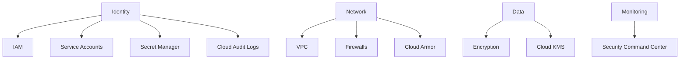

---

## Networking in GCP

### Prerequisites
- [GCP Fundamentals](#gcp-fundamentals)

### Learning Objectives
- Design and implement GCP networks
- Configure load balancing
- Manage DNS and certificates

### Key Concepts
- VPC networks and subnets
- Cloud Load Balancing
- Cloud DNS
- Cloud CDN
- VPN and Interconnect
- Private Google Access
- Kubernetes ingress and managed certificates

### Hands-on Exercises
1. Create VPC networks
2. Configure load balancers
3. Set up Cloud DNS and managed certificates

### Visual: GCP Networking Architecture
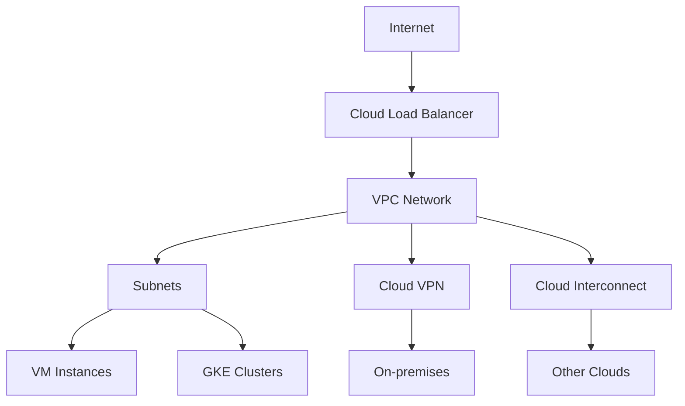

---

## Observability on GCP

### Prerequisites
- [GKE](#google-kubernetes-engine-gke)

### Learning Objectives
- Monitor applications and infrastructure
- Set up logging and metrics
- Create dashboards and alerts

### Key Concepts
- Cloud Monitoring
- Cloud Logging
- Cloud Trace
- Error Reporting
- Cloud Profiler
- Custom metrics
- OpenTelemetry basics

### Hands-on Exercises
1. Configure Cloud Monitoring
2. Set up dashboards
3. Create alerting policies
4. Export application traces with OpenTelemetry

### Visual: Observability Stack
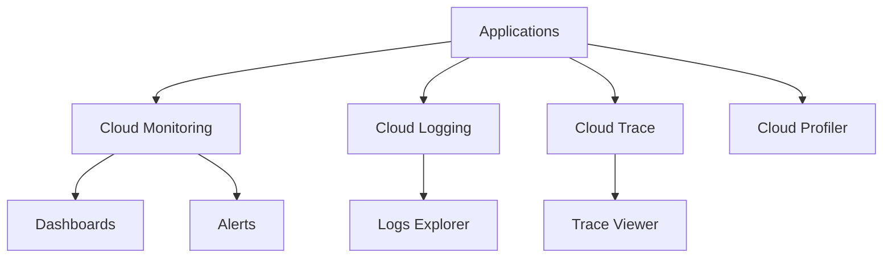

---

## Debugging and Troubleshooting

### Prerequisites
- [GKE](#google-kubernetes-engine-gke)
- [Observability on GCP](#observability-on-gcp)

### Learning Objectives
- Diagnose cluster issues
- Debug application problems
- Use debugging tools effectively

### Key Concepts
- kubectl debugging commands
- Ephemeral debug containers
- Cloud Logging and Error Reporting
- Error analysis
- Performance troubleshooting

### Hands-on Exercises
1. Debug pod issues
2. Analyze logs
3. Use kubectl debug and ephemeral containers
4. Correlate errors with traces and logs

### Visual: Debugging Workflow
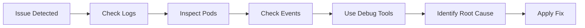

---

## AWS Fundamentals

### Prerequisites
- None (optional: [GCP Fundamentals](#gcp-fundamentals) for cross-cloud comparison)

### Learning Objectives
- Understand AWS core services
- Navigate AWS Console
- Basic resource management

### Key Concepts
- AWS Accounts and Organizations
- IAM (Identity and Access Management)
- Billing and Cost Management
- Budgets, quotas, and alerts
- Regions and Availability Zones

### Hands-on Exercises
1. Create an AWS account
2. Set up billing alerts and a budget
3. Explore AWS Console

### Visual: AWS Architecture Overview
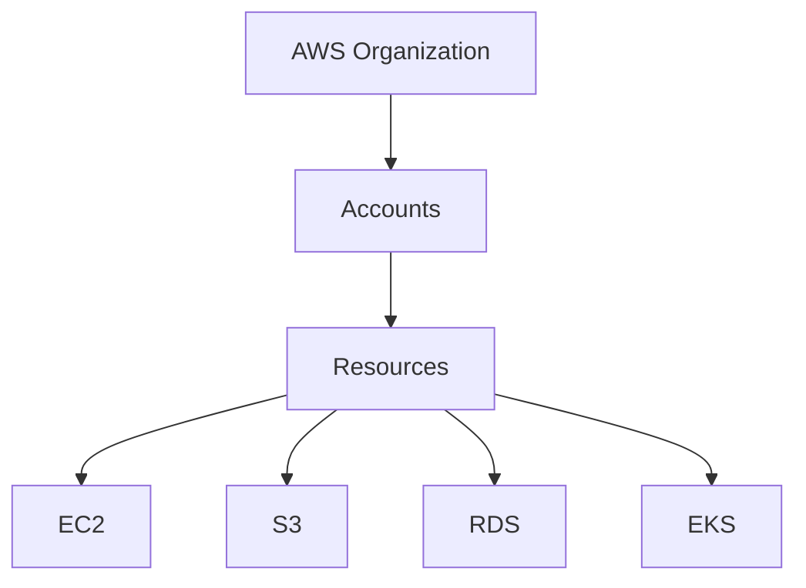

---

## Amazon EKS (Elastic Kubernetes Service)

### Prerequisites
- [Docker and Kubernetes Basics](#docker-and-kubernetes-basics)
- [AWS Fundamentals](#aws-fundamentals)

### Learning Objectives
- Deploy and manage EKS clusters
- Configure node groups
- Implement autoscaling

### Key Concepts
- EKS cluster architecture
- Node groups and instance types
- Fargate vs managed nodes
- Cluster upgrades
- IAM Roles for Service Accounts (IRSA)
- Cluster Autoscaler or Karpenter

### Hands-on Exercises
1. Create an EKS cluster
2. Deploy applications
3. Configure autoscaling and IRSA

### Visual: EKS Cluster Architecture

---

## Infrastructure as Code with Terraform on AWS

### Prerequisites
- [AWS Fundamentals](#aws-fundamentals)
- [Infrastructure as Code with Terraform](#infrastructure-as-code-with-terraform)

### Learning Objectives
- Write Terraform configurations for AWS
- Manage AWS resources with Terraform
- Implement state management

### Key Concepts
- AWS provider for Terraform
- Resources and data sources
- Variables and outputs
- Remote state and state locking
- Modules and workspaces

### Hands-on Exercises
1. Configure AWS provider
2. Create AWS resources
3. Configure remote state in S3 with locking
4. Manage infrastructure lifecycle

### Visual: Terraform Workflow (AWS)

---

## CI/CD with GitLab on AWS

### Prerequisites
- [Docker and Kubernetes Basics](#docker-and-kubernetes-basics)
- [Amazon EKS](#amazon-eks-elastic-kubernetes-service)
- [CI/CD with GitLab](#cicd-with-gitlab)

### Learning Objectives
- Set up GitLab CI pipelines for AWS
- Build and deploy containerized apps
- Implement testing and security scans

### Key Concepts
- GitLab CI/CD pipelines
- .gitlab-ci.yml
- Runners and executors
- Artifacts and caching
- Amazon ECR integration
- Pipeline secrets and protected environments

### Hands-on Exercises
1. Configure GitLab project
2. Create CI/CD pipeline
3. Build and push an image to Amazon ECR
4. Deploy to EKS

### Visual: GitLab CI Pipeline (AWS)

---

## Security in AWS

### Prerequisites
- [AWS Fundamentals](#aws-fundamentals)

### Learning Objectives
- Implement security best practices
- Manage identities and access
- Secure network configurations

### Key Concepts
- IAM roles and policies
- Secrets Manager and Parameter Store
- CloudTrail
- Security groups
- VPC security
- AWS WAF
- AWS Security Hub
- Policy-as-code basics

### Hands-on Exercises
1. Configure IAM policies
2. Manage application secrets with Secrets Manager
3. Review CloudTrail events
4. Set up security groups
5. Implement AWS WAF rules

### Visual: AWS Security Layers
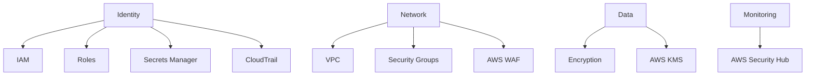

---

## Networking in AWS

### Prerequisites
- [AWS Fundamentals](#aws-fundamentals)

### Learning Objectives
- Design and implement AWS networks
- Configure load balancing
- Manage DNS and certificates

### Key Concepts
- VPC networks and subnets
- Elastic Load Balancing
- Route 53
- CloudFront
- VPN and Direct Connect
- VPC endpoints
- Kubernetes ingress and AWS Load Balancer Controller

### Hands-on Exercises
1. Create VPC networks
2. Configure load balancers
3. Set up Route 53 and TLS certificates

### Visual: AWS Networking Architecture
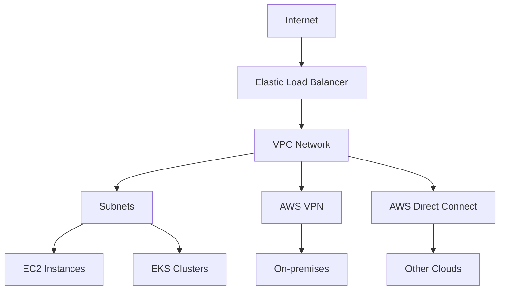

---

## Observability on AWS

### Prerequisites
- [Amazon EKS](#amazon-eks-elastic-kubernetes-service)

### Learning Objectives
- Monitor applications and infrastructure
- Set up logging and metrics
- Create dashboards and alerts

### Key Concepts
- CloudWatch
- CloudWatch Logs, Metrics, Alarms, and Container Insights
- AWS X-Ray
- AWS Distro for OpenTelemetry
- Amazon Managed Service for Prometheus
- Amazon Managed Grafana
- Custom metrics

### Hands-on Exercises
1. Configure CloudWatch
2. Enable Container Insights
3. Set up dashboards
4. Create alerting policies
5. Export application traces with OpenTelemetry

### Visual: Observability Stack (AWS)
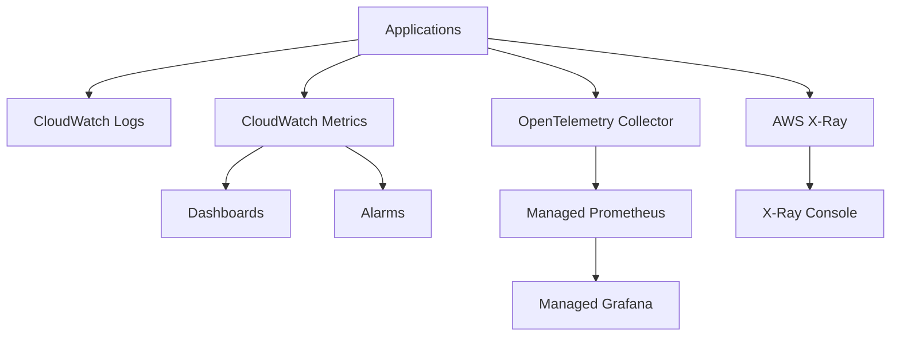

---

## Debugging and Troubleshooting on AWS

### Prerequisites
- [Amazon EKS](#amazon-eks-elastic-kubernetes-service)
- [Observability on AWS](#observability-on-aws)

### Learning Objectives
- Diagnose cluster issues
- Debug application problems
- Use debugging tools effectively

### Key Concepts
- kubectl debugging commands
- AWS X-Ray
- Ephemeral debug containers
- CloudWatch Logs and Container Insights
- Error analysis
- Performance troubleshooting

### Hands-on Exercises
1. Debug pod issues
2. Analyze logs
3. Use kubectl debug and ephemeral containers
4. Correlate errors with traces and logs

### Visual: Debugging Workflow (AWS)

---

## Additional Resources

- [Google Cloud Documentation](https://cloud.google.com/docs)
- [AWS Documentation](https://docs.aws.amazon.com/)
- [Kubernetes Documentation](https://kubernetes.io/docs/)
- [Docker Documentation](https://docs.docker.com/)
- [Terraform Documentation](https://developer.hashicorp.com/terraform/docs)
- [Argo CD Documentation](https://argo-cd.readthedocs.io/)
- [GitLab CI/CD Documentation](https://docs.gitlab.com/ee/ci/)

## Best Practices

1. Always follow the principle of least privilege
2. Implement proper monitoring and alerting
3. Use infrastructure as code for all resources
4. Regularly update and patch systems
5. Implement backup, restore, and disaster recovery plans
6. Start with multi-zone high availability; use multi-region architectures when RTO, RPO, and business requirements justify the added cost and complexity
7. Implement proper security controls and compliance
8. Monitor costs, quotas, and resource usage
9. Keep secrets out of source control and CI logs
10. Use remote state, locking, and code review for infrastructure changes

## Certification Recommendations

- Google Cloud Professional Cloud Architect
- AWS Certified Solutions Architect
- Certified Kubernetes Administrator (CKA)
- Terraform Associate Certification
- GitLab Certified CI/CD Specialist
